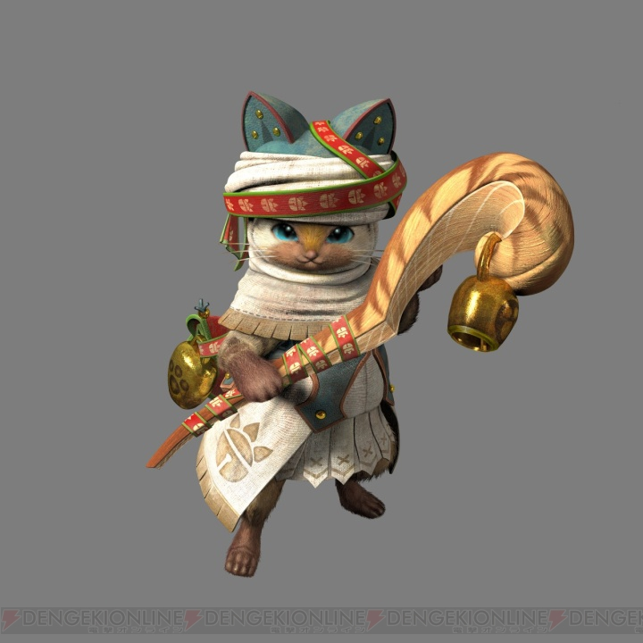

The content below is an example project proposal / requirements document. Replace the text below the lines marked "__TODO__" with details specific to your project. Remove the "TODO" lines.

(___TODO__: your project name_)

# Festival Chronicle 

## Overview

(___TODO__: a brief one or two paragraph, high-level description of your project_)

Festival, as a event combining various aspects from a culture, is the precious gift of thousands of years' civilization. Different cultures brew diverse festivals. Sometimes we to know a new culture through the lens of its festivals. Festival Chronicle is the best navigator for your voyage to the festival kingdom.

Festival Chronicle is a web app that will allow users to learn basic knowledge of different festivals from different cultures. Users can register and login. Once they're logged in, they can create their own questions for other users to study. For every question that they create, they can choose where to be left blank. They can also doing another's questions or just viewing flashcards. Each user has their own stats (quiz scores and number of questions created) shown on the ranking list.


## Data Model

(___TODO__: a description of your application's data and their relationships to each other_) 

The application will store Users, Festivals, Questions

* users can create multiple questions (via references) which can be modiefied. 
* each festival can have multiple questions (by embedding)
* each user has a stats recording his/her score (by embedding)

(___TODO__: sample documents_)

An Example User:

```javascript
{
  username: "festivalcitizen",
  hash: // a password hash,
  myQuestions: // an array of references to Question documents this user has created
  stat: { quiz: 17, accuracy: 0.6, ownQuestion: 10 } // the stats of this user, number of quiz took, accuracy and number of questions created
}
```

An Example Festival with Embedded Questions:

```javascript
{
  name: "Christmas", // name of the festival
  questions: [
    { 
        createdBy: // reference to the user object of the user created this question
        flashcard: "Christmas is an annual festival commemorating the birth of Jesus Christ, observed most commonly on December 25th as a religious and cultural celebration.", // flashcard of this question
        blank: [0, 8] // array of indexes of blanks set by the question creater
    },
    { 
        createdBy: // reference to the user object of the user created this question
        flashcard: "December 24th is called Christmas Eve.", // flashcard of this question
        blank: [4, 5] // array of indexes of blanks set by the question creater
    },
  ]
}
```


## [Link to Commented First Draft Schema](db.js) 

(___TODO__: create a first draft of your Schemas in db.js and link to it_)

## Wireframes

(___TODO__: wireframes for all of the pages on your site; they can be as simple as photos of drawings or you can use a tool like Balsamiq, Omnigraffle, etc._)

/list/create - page for creating a new shopping list



/list - page for showing all shopping lists


/list/slug - page for showing specific shopping list


## Site map

(___TODO__: draw out a site map that shows how pages are related to each other_)

Here's a [complex example from wikipedia](https://upload.wikimedia.org/wikipedia/commons/2/20/Sitemap_google.jpg), but you can create one without the screenshots, drop shadows, etc. ... just names of pages and where they flow to.

## User Stories or Use Cases

(___TODO__: write out how your application will be used through [user stories](http://en.wikipedia.org/wiki/User_story#Format) and / or [use cases](https://www.mongodb.com/download-center?jmp=docs&_ga=1.47552679.1838903181.1489282706#previous)_)

1. as non-registered user, I can register a new account with the site
2. as a user, I can log in to the site
3. as a user, I can create a new grocery list
4. as a user, I can view all of the grocery lists I've created in a single list
5. as a user, I can add items to an existing grocery list
6. as a user, I can cross off items in an existing grocery list

## Research Topics

(___TODO__: the research topics that you're planning on working on along with their point values... and the total points of research topics listed_)

* (5 points) Integrate user authentication
    * I'm going to be using passport for user authentication
    * And account has been made for testing; I'll email you the password
    * see <code>cs.nyu.edu/~jversoza/ait-final/register</code> for register page
    * see <code>cs.nyu.edu/~jversoza/ait-final/login</code> for login page
* (4 points) Perform client side form validation using a JavaScript library
    * see <code>cs.nyu.edu/~jversoza/ait-final/my-form</code>
    * if you put in a number that's greater than 5, an error message will appear in the dom
* (5 points) vue.js
    * used vue.js as the frontend framework; it's a challenging library to learn, so I've assigned it 5 points

10 points total out of 8 required points (___TODO__: addtional points will __not__ count for extra credit_)


## [Link to Initial Main Project File](app.js) 

(___TODO__: create a skeleton Express application with a package.json, app.js, views folder, etc. ... and link to your initial app.js_)

## Annotations / References Used

(___TODO__: list any tutorials/references/etc. that you've based your code off of_)

1. [passport.js authentication docs](http://passportjs.org/docs) - (add link to source code that was based on this)
2. [tutorial on vue.js](https://vuejs.org/v2/guide/) - (add link to source code that was based on this)


